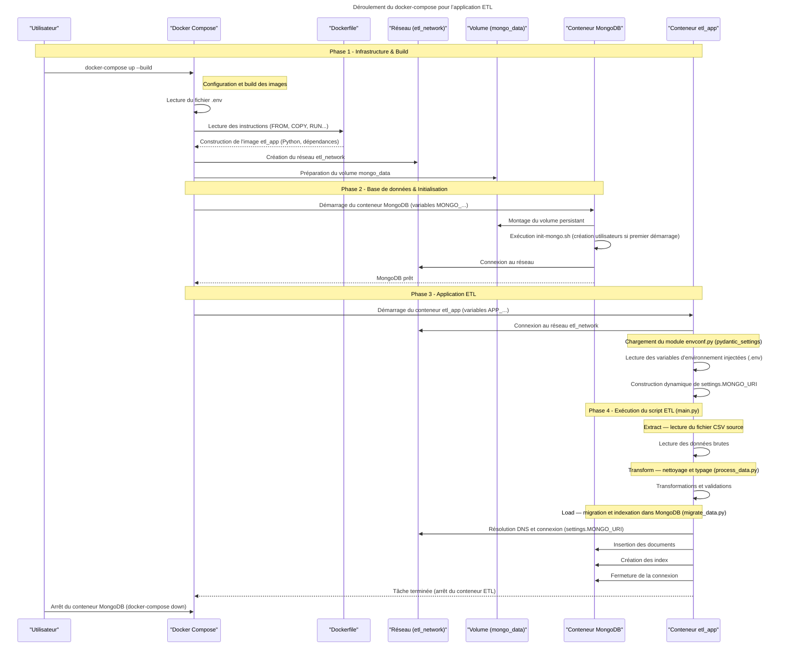

# Migration de données médicales vers MongoDB

Projet 5 de la formation Data Engineer d'Open Classrooms

## Contexte du Projet
Dans le cadre de la modernisation de l'infrastructure de données d'un client du secteur médical, ce projet vise à migrer un historique de patients (format CSV) vers une base de données NoSQL MongoDB.

L'objectif est de résoudre les problèmes de scalabilité actuels en passant d'un format plat (CSV) à une architecture distribuée et conteneurisée via Docker, préparant ainsi le terrain pour un futur déploiement Cloud (AWS).

Ce projet implémente un pipeline ETL (Extract, Transform, Load) conteneurisé pour migrer un jeu de données de santé (`healthcare_dataset.csv`) vers une base de données **MongoDB**.

L'application est construite en **Python 3.9**, gérée par **uv** pour les dépendances, et orchestrée via **Docker Compose**.

## Fonctionnalités

* **Extraction & Nettoyage** : Lecture du CSV, normalisation des noms (Title Case), typage des dates, formatage des colonnes en *snake_case* et déduplication.
* **Migration MongoDB** : Insertion par lots (par 1000) pour gérer la charge.
* **Idempotence** : Le script nettoie la collection cible avant l'insertion pour éviter les doublons lors des relances.
* **Optimisation** : Création automatique d'index (simples et composés) sur les champs `name`, `admission_type` et `date_of_admission` après la migration.
* **Sécurité** : Gestion des accès bases de données via variables d'environnement et script d'initialisation.

## Stack et architecture Technique

* **Langage** : Python 3.9
* **Base de données** : MongoDB 8.0
* **Dépendances** :
  * `pandas` : Manipulation et nettoyage des données.
  * `pymongo` : Driver MongoDB.
  * `pydantic-settings` : Gestion robuste de la configuration.
  * `uv` : Gestionnaire de paquets (utilisé dans le build Docker).
* **Infrastructure** : Docker & Docker Compose.

```
.
├── .env                   			# variables d'environnement
├── Dockerfile             			# configuration de l'image Docker
├── docker-compose.yml	  			# Orchestration
├── init-mongo/			  			# Script d'initialisation de MongoDB
│   └── init-mongo.sh
├── uv.lock          		  		# Vérouillage des dépendances UV
├── pyproject.toml		  			# Configuration de UV et des dépendances
├── data/
│   └── healthcare_dataset.csv 	    # Fichier des données à migrer
└── src/
    └── main.py             		# Point d'entrée pour la migration
│   ├── utils/             		    # Utilitaires
│   │   └── envconf.py      		# Charge les variables d'environnement
│   └── pipelines/          		# Scripts de pipeline
│       ├── migrate_data.py 		# Logique de migration vers MongoDB (Chargement)
│       └── process_data.py 		# Extraction et Transformation du CSV
├── tests/                  
│   ├── integration/        		# Tests d'intégration avec mongomock
│   │   └── test_migrate_data.py
│   └── unit/               		# Tests unitaires
│       └── test_process_data.py
└── README.md               		# Description du projet, guide d'utilisation
```

Le projet utilise Docker Compose pour orchestrer deux services principaux :

mongodb : Le serveur de base de données.

etl_app : Un conteneur Python éphémère qui effectue l'ETL (Extract, Transform, Load).
    
## Guide de Démarrage
### Prérequis
[Docker Desktop](https://www.docker.com/get-started/) installé et lancé.

[Git](https://git-scm.com/) pour cloner le dépôt.

[MongoDB Compass](https://www.mongodb.com/products/tools/compass) pour visualiser les datas et faire des requêtes.

### Installation et Lancement
1. **Cloner le dépôt :**

```
git clone https://github.com/PierreDff/OC_DE_projet5.git
cd OC_DE_projet5.git 
```
2. **Créer votre .env (modifier le ".env.example")**

Deux utilisateurs sont créés :
- le root ayant tous les droits
- l'utilisateur app_user qui peut lire et écrire
```
# Identifiants Application
APP_USER=app_user
APP_PASSWORD=mon_mot_de_passe_securise

# Identifiants Root MongoDB
MONGO_ROOT_USER=admin
MONGO_ROOT_PASSWORD=mon_mot_de_passe_root

# Configuration Base de Données
MONGO_HOST=mongodb
MONGO_PORT=27017
MONGO_DB=healthcare_db
MONGO_COLLECTION=patients
BATCH_SIZE=1000
```

3. **Lancer la migration (construction des images et démarrage) :**

```
docker-compose up --build
```

4. **Vérification : Le script s'arrêtera automatiquement une fois la migration terminée :**

Vous devriez voir dans les logs : "Test d'intégrité réussi : Tous les documents sont présents."

5. **Pour arrêter le conteneur et le réseau / pour le relancer :**
```
docker-compose down
```

```
docker-compose up
```

6. **Connexion à mongosh depuis le conteneur :**

En tant qu'admin :
```
docker-compose exec mongodb mongosh -u admin -p mot_de_passe --authenticationDatabase admin
```
En tant qu'utilisateur :
```
docker-compose exec mongodb mongosh -u app_user -p mon_mot_de_passe_securise --authenticationDatabase healthcare_db
```

## Tests et Qualité du Code 
Les tests ne sont pas exécutés automatiquement au lancement de l'application (image de production). Voici comment les lancer manuellement.  
1. **Installer les dépendances de développement**
```
pip install ".[dev]"
```
2. **Lancer la suite de tests (unitaires et intégration)**
```
pytest
```

## Fonctionnement de l'application



## Modélisation des Données (Schema Design)

**Collection : patients**


Champ | Type | Description
------|------|------------
```Name``` | string | Nom
```Age``` | int |	Âge
```Gender```| string | Genre
```Blood_Type``` | string | Groupe sanguin
```Medical_Condition``` | string | Pathologie
```Date_of_Admission```| date| Date d'admission
```Doctor``` | string | Médecin en charge
```Hospital``` | string | Nom de l'hôpital d'admission
```Insurance_Provider``` | string | Nom de l'assureur
```Billing_Amount``` | float| Montant de la facture
```Room_Number``` | int | Numéro de chambre
```Admission_Type``` | string | Type d'admission (Urgence...)
```Discharge_Date``` | date | Date de sortie
```Medication``` | string | Médication
```Test_Results``` | string | Résultats des tests médicaux

**Exemple de Document (JSON) :**
```
{
  "_id": "ObjectId(...)",
  "name": "B**** J******",
  "age": 30,
  "gender": "Male",
  "blood_type": "B-"
  "date_admission": ISODate("2024-01-31T00:00:00Z"),
  "hospital": "Sons and Miller",
  "admission_type": "Urgent",
  "doctor": "Matthew Smith"
  "condition": "Cancer",
  "medication": "Paracetamol",
  "test_results": "Normal"
  "provider": "Blue Cross",
  "billing_amount": 18856.28
  "room_number": 328,
  "admission_type": "Urgent",
  "discharge_date": ISODate("2024-02-02T00:00:00.000Z"),
  "medication": "Paracetamol",
  "test_results": "Normal"
  }

```
Justification : Cette structure réduit le besoin de jointures coûteuses et regroupe les données qui sont souvent consultées ensemble.


## Stratégie d'Indexation (Performance)
Pour garantir des temps de réponse rapides sur les requêtes fréquentes, deux stratégies d'indexation sont appliquées automatiquement après la migration :

1. **Index Simple sur `name`** : 
   - *Objectif* : Recherche instantanée d'un patient par son nom (complexité O(log n)).
   - *Usage* : Barre de recherche dans l'application métier.

2. **Index Composé sur `admission_type` (1) et `date_of_admission` (-1)** :
   - *Objectif* : Optimiser les tris et filtres chronologiques.
   - *Usage* : Tableaux de bord (ex: "Afficher les 10 dernières admissions d'Urgence").


## Logique du Script de Migration (ETL)
Le script migrate.py suit les étapes suivantes :

Extract (Extraction) : Chargement du CSV via Pandas.

Clean (Nettoyage) :

Suppression des doublons (534 doublons identifiés lors de l'audit).

Normalisation des noms (Mise en format "Title Case").

Transform (Transformation) :

Conversion des chaînes de caractères "Dates" en objets ISODate (format natif MongoDB).

Restructuration des colonnes plates en dictionnaires imbriqués.

Load (Chargement) :

Utilisation de insert_many() pour une insertion en masse optimisée.

Indexation : Création d'index sur `name` et le couple `admission_type` + `date_of_admission` pour accélérer les recherches futures.

## Sécurité et Gestion des Utilisateurs
Dans cet environnement Dockerisé, l'authentification est gérée via les variables d'environnement (voir docker-compose.yml).

Rôles définis :

Root (Admin) : Droits complets sur le cluster. Créé au lancement du conteneur Mongo.

App User (Simulé) : Dans un environnement de production, l'application utiliserait un utilisateur avec des droits limités (readWrite sur la db hospital_db uniquement) au lieu du root.

## Choix Techniques
**Pourquoi MongoDB ?**

La variété des conditions médicales et l'évolution potentielle des protocoles de soins rendent le schéma flexible du NoSQL plus adapté que le SQL rigide.

**Pourquoi Docker ?**

Assure que le script de migration s'exécute exactement de la même manière sur la machine du développeur et sur le futur serveur de production, éliminant les erreurs de type "ça marche chez moi".

**Prochaines étapes (Roadmap AWS)**

Déploiement de l'image Docker sur Amazon ECR (Elastic Container Registry).

Hébergement du script sur Amazon ECS (Elastic Container Service).

Migration de la base de données vers MongoDB Atlas sur AWS ou Amazon DocumentDB.
